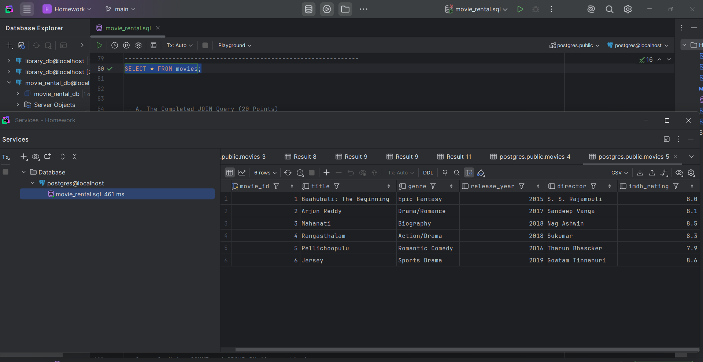
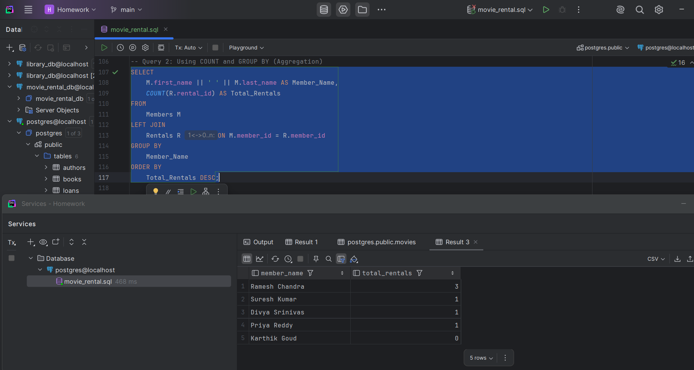
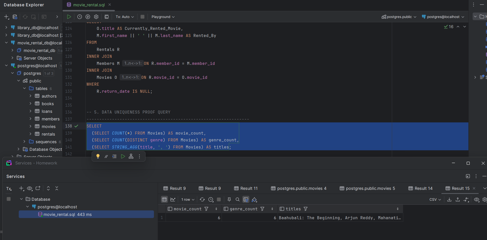

# Week 2: Movie Rental Database Submission

This folder contains the complete SQL script (`movie_rental.sql`) and the required evidence screenshots for the assignment, demonstrating the three-table JOIN and data uniqueness requirements.

---

### 1. All Movies Data (`SELECT * FROM Movies`)

**Requirement:** Show the Movies table with unique data (Telugu movies, genres, and custom fields).

---

### 2. Three-Table JOIN Query (Core Requirement)

**Requirement:** Show the complete SQL query and results in one image, linking Members, Movies, and Rentals.

---

### 3.  Data Uniqueness Proof

**Requirement:** Prove the database contains at least 5 movies and 3 unique genres.

